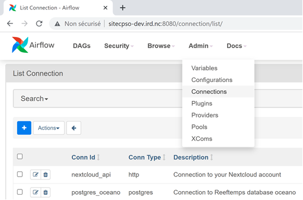
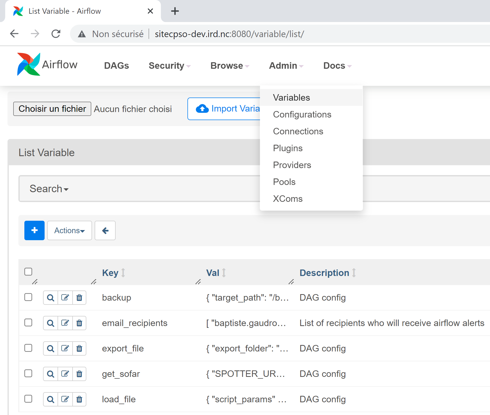

#   ReefTEMPS AIRFLOW 

## Getting Started

* Clone the project :
```
git clone https://gitlab.in2p3.fr/reeftemps/airflow_deploy.git
```

 ### Configuration
 
*  In the `.env` file, update :
    *  `AIRFLOW_STMP__` variables to configure sender's email details
    *  `AIRFLOW__WEBSERVER__BASE_URL` hostname or ip to your airflow webserver like *`http://yourairflowserverdomain:port`*
    *  `AIRFLOW_MAIL_LIBELLE` label at the beginning of the email subject line if not defined set as AIRFLOW
    *  `DIR_DATA_SRC` directory used for data import and export
    *  `DIR_DUMP_SRC` directory where is stored the database dump file 
    *  `DIR_LOG_SRC` logs directory
    *  `DIR_RSS_SRC` path to the rss file 

* Then you can run the container :
``` 
docker-compose up
```
### Airflow Connections 
Airflow’s Connection object is used for storing informations necessary for connecting to external services like your database or your Nextcloud account.

You can update `plugins/confs/connections.json` with your own connection settings and import it in your running Airflow instance by excuting:
```
./airflow.sh connections import plugins/confs/connections.json
```
You can also update your Connections directly from the web interface : 


    

### Airflow Variables
* Airflow variables are used to configure the different DAGs. In `plugins/confs/variables.json` you can find the default variables configuration, update it for your own needs and import it in your Airflow with:
```
./airflow.sh variables import plugins/confs/variables.json
```
Like Connections, you can update the variables directly from the web interface : 




